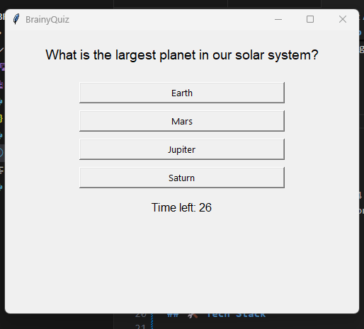

# 🧠 BrainyQuiz – Smart Quiz App with Timer

BrainyQuiz is a Python-based GUI application that allows users to take multiple-choice quizzes with a countdown timer. It's perfect for testing your knowledge or creating custom quizzes for others!

## 📸 Preview
(assets/screenshot.png) 

---

## 🚀 Features

- ✅ Multiple-choice quiz with 4 options
- 🕒 30-second timer per question
- 📊 Score tracking at the end
- 📁 Question storage in JSON
- 🎨 Simple Tkinter-based GUI

---

## 🛠️ Tech Stack

- **Python 3**
- **Tkinter** – GUI framework
- **JSON** – for storing questions

---

## Install dependencies


---

## 📦 Installation

1. **Clone the repository**:
   ```bash
   git clone https://github.com/your-username/BrainyQuiz.git
   cd BrainyQuiz

---

## Install dependencies:

pip install -r requirements.txt

---

## Run the app:

python main.py

--- 